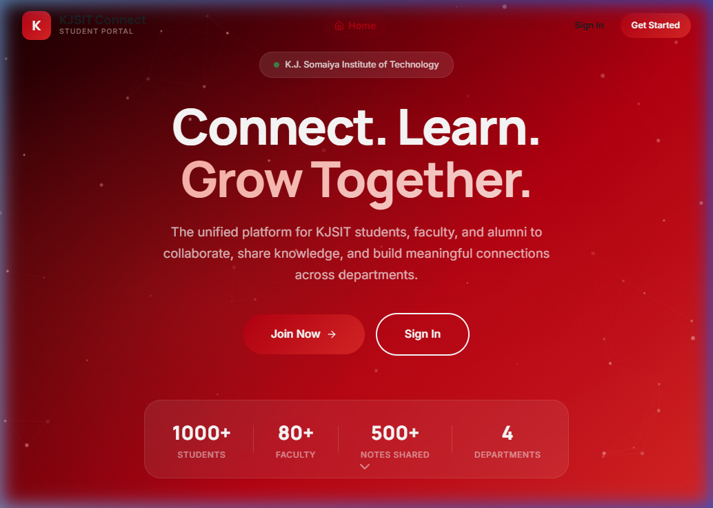
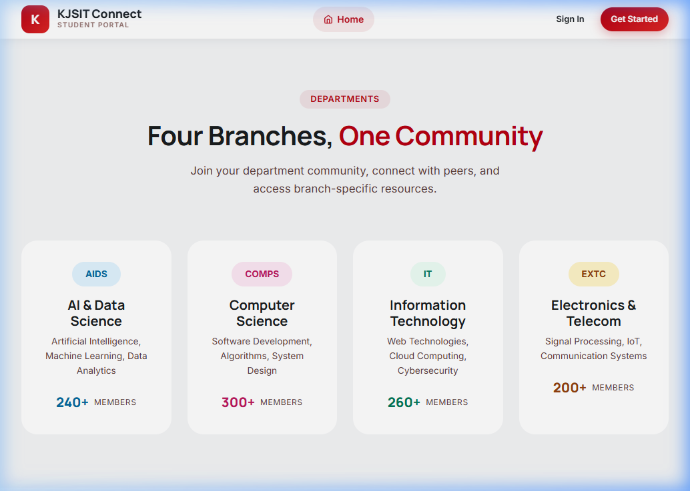
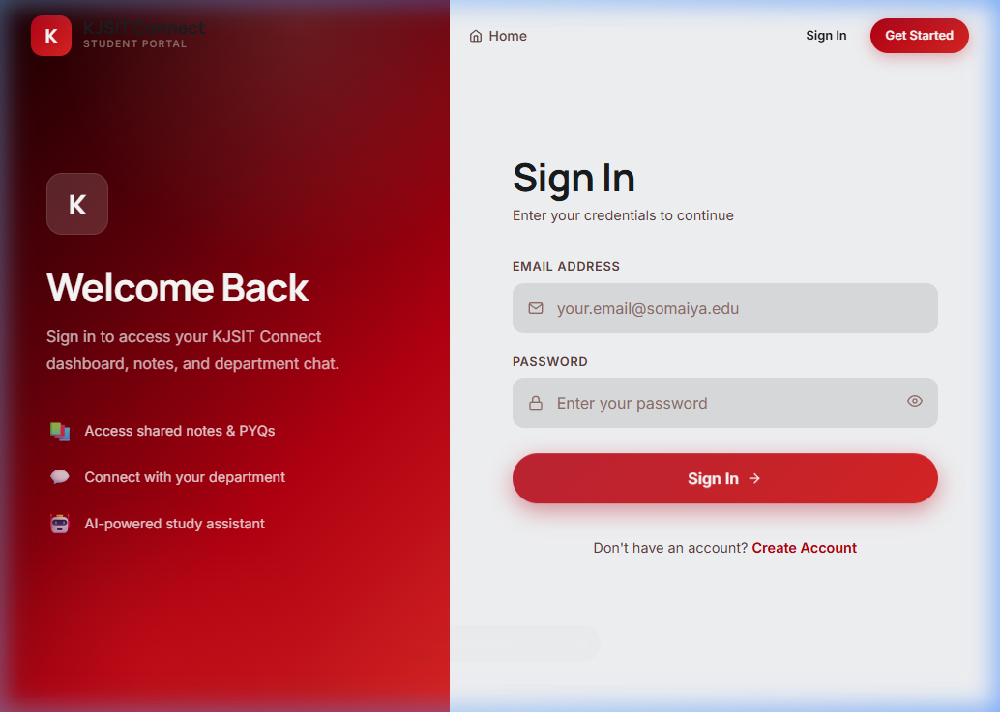
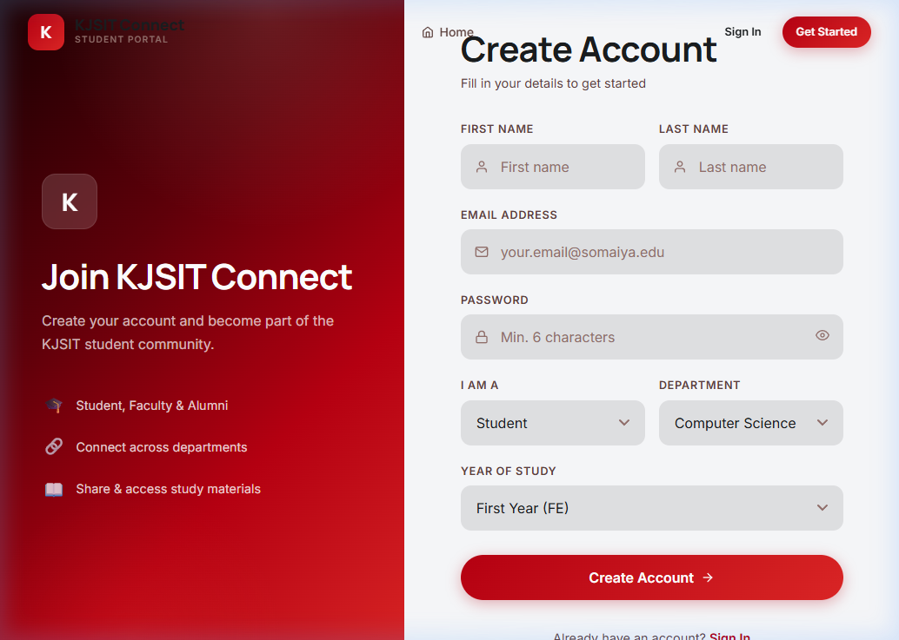

# 🎓 KJSIT Connect - Student Portal

> **A comprehensive full-stack platform built with Node.js, React, and MySQL for K.J. Somaiya Institute of Technology.**

KJSIT Connect is a unified student portal designed to bring together students, faculty, and alumni across all departments. The platform facilitates notes sharing, real-time departmental discussions, AI-powered study assistance, and more.

## 📸 Screenshots

| Landing Page - Hero | Departments Showcase |
| :---: | :---: |
|  |  |

| Split-Screen Login | Account Registration |
| :---: | :---: |
|  |  |

## ✨ Key Features

### 1. 🏠 Landing & Dashboard
- Animated particle canvas hero section with an immersive crimson gradient theme.
- Personalized dashboard featuring a time-based greeting, quick action shortcuts, statistics, and a recent notes feed.

### 2. 🔐 Advanced Authentication
- Robust JWT-based authentication supporting Students, Faculty, and Alumni.
- Role-based and department-specific (AIDS, COMPS, IT, EXTC) registration with input validation.

### 3. 📝 Notes Sharing Library
- Easily upload and download study materials (notes, PYQs, assignments).
- Filter materials by department, year of study, semester, and material type.
- Built-in star ratings and download counters to find the best resources quickly.

### 4. 💬 Real-Time Department Chat
- Live chat powered by Socket.IO featuring 4 dedicated rooms for each department.
- Identifiable role badges (Faculty, Alumni, Student) right alongside messages.

### 5. 🤝 Connect & Discover
- Dedicated networking page to find peers, faculty, and successful alumni.
- Features powerful live filtering and the ability to send connection requests or view LinkedIn/GitHub profiles.

### 6. 🤖 AI-Powered Study Bot
- AI-assistant to boost productivity with 5 dedicated modes:
  - **Conversational Chat**: Ask any study-related query.
  - **Summarize**: Create brief summaries from dense study materials.
  - **Key Points**: Extract bullet points from text.
  - **Explain**: Simplify complex topics into readable insights.
  - **Quiz Generator**: Instantly create practice tests to solidify your understanding.

## 🛠️ Tech Stack

| Layer | Technology |
|-------|-----------|
| **Frontend** | React 19 + Vite 5, React Router v7 |
| **Styling** | Custom Vanilla CSS Design System ("Crimson Horizon") |
| **Backend** | Node.js, Express.js 5 |
| **Database** | MySQL 2 (promise-based), `init.sql` provided |
| **Authentication** | JSON Web Tokens (JWT) + bcrypt.js |
| **Real-time** | Socket.IO |
| **File Handling** | Multer |

## 🚀 Setup & Installation

### Prerequisites
- [Node.js](https://nodejs.org/) (v18 or higher)
- [MySQL](https://www.mysql.com/) (v8 or higher, or via XAMPP/WAMP)

### 1. Database Setup
1. Open your MySQL command-line client or a GUI tool like phpMyAdmin/MySQL Workbench.
2. Run the provided initialization script to create the DB and tables (this generates the `kjsit_connect` database and seeds sample data):
   ```bash
   mysql -u root -p < server/config/init.sql
   ```

### 2. Backend Setup
1. Navigate to the `server` directory:
   ```bash
   cd server
   ```
2. Install dependencies:
   ```bash
   npm install
   ```
3. Your `.env` file should look like this (already configured out-of-the-box):
   ```env
   PORT=5000
   DB_HOST=localhost
   DB_USER=root
   DB_PASS=Root   # Change this based on your MySQL credentials
   DB_NAME=kjsit_connect
   JWT_SECRET=your_jwt_secret_key_here
   ```
4. Start the backend Node server:
   ```bash
   npm start
   ```

### 3. Frontend Setup
1. Open a new terminal and navigate to the `client` directory:
   ```bash
   cd client
   ```
2. Install dependencies:
   ```bash
   npm install
   ```
3. Start the Vite React development server:
   ```bash
   npm run dev
   ```
4. Open your browser and navigate to `http://localhost:5173/`!

> **Note:** The frontend has fallback demo data built-in, meaning components like Notes, Chat, and Connect will be visually functional for previewing even if the Express backend is not running. 

## 🏗️ Project Structure
```text
SSTC/
├── client/                 # React Frontend (Vite)
│   ├── src/
│   │   ├── components/     # Reusable UI components (Navbar, etc.)
│   │   ├── context/        # React Context (AuthContext)
│   │   ├── pages/          # Layout & functional components
│   │   ├── App.jsx         # App routing (Protected/Public routes)
│   │   └── index.css       # Complete global design system & tokens
├── server/                 # Node.js Backend API
│   ├── config/             # DB connection & init schema
│   ├── middleware/         # JWT verification logic
│   ├── routes/             # API routes (auth, notes, chat, connect, chatbot)
│   ├── uploads/notes/      # Default folder for user file uploads
│   └── index.js            # Express server initialization + Socket.io core
└── docs/images/            # README screenshots
```

## 📄 License
This project is for educational purposes.
